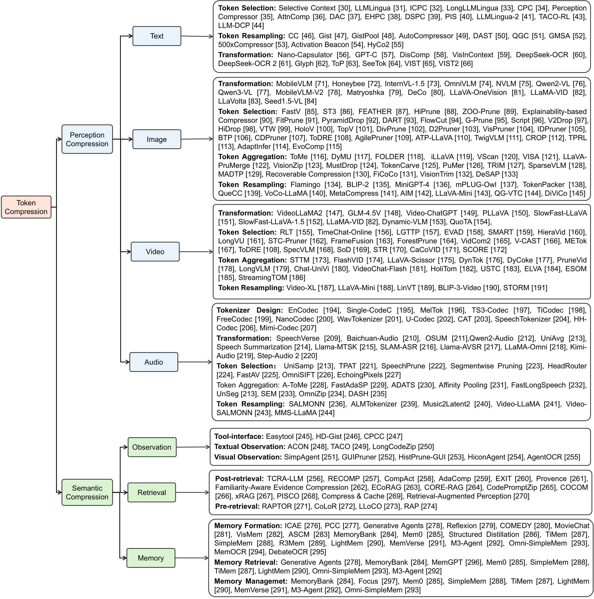
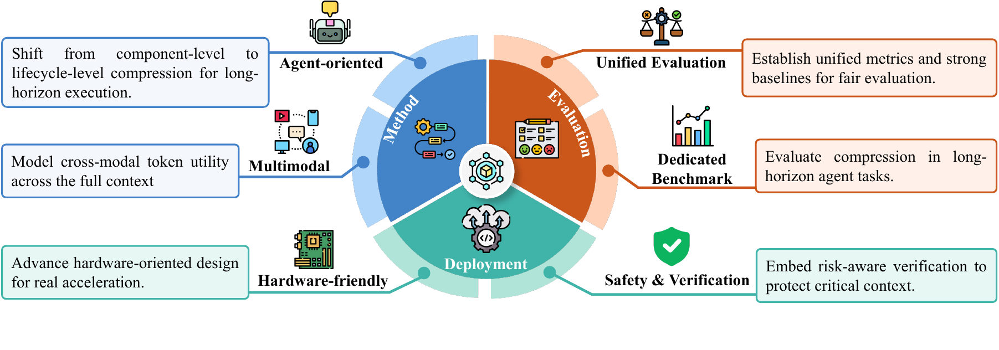

# Token Compression in the AI Agent Lifecycle: A Comprehensive Survey from Perceptual Inputs to Semantic Contexts

[](https://awesome.re)


> A curated, taxonomy-organized paper list on **token compression** from current perceptual inputs to accumulated workflow contexts in the AI agent lifecycle.
>
> Accompanying the survey paper:
> **"Token Compression in the AI Agent Lifecycle: A Comprehensive Survey from Perceptual Inputs to Semantic Contexts"**
> *Fengxi Zhang · Zhengxue Cheng · Li Song · Zhu Li · Wenjun Zhang*

> **📢 Contributions Welcome** — submit a pull request to add papers, fix venue/GitHub info, or suggest improvements.

⭐ If you find this repo useful, please give us a star!

## 📖 Table of Contents

- [Introduction](#-introduction)
- [Problem Formulation](#-problem-formulation)
- [Tag Legend](#-tag-legend)
- [Perception Compression](#-perception-compression)
  - [💬 Text](#-text-token-compression)
  - [🖼️ Image](#-image-token-compression)
  - [🎬 Video](#-video-token-compression)
  - [🔊 Audio](#-audio-token-compression)
- [Semantic Compression](#-semantic-compression)
  - [🔍 Retrieval](#-retrieval-token-compression)
  - [🧠 Thought](#-thought-token-compression)
  - [🛠️ Action-Observation](#-action-observation-token-compression)
  - [🧩 Memory](#-memory-token-compression)
- [Challenges and Future Directions](#-challenges-and-future-directions)
- [Citation](#-citation)

## 🚀 Introduction


Tokens serve as the fundamental interface through which foundation models represent inputs, maintain contexts, and support reasoning. In AI agents, tokens arise not only from current perceptual inputs, but also from workflow contexts accumulated across multi-step execution, including retrieval results, reasoning traces, action--observation histories, and memory records. Dense multimodal inputs and iterative workflow accumulation lead to token explosion, increasing inference cost and making active-context management critical for efficient and reliable agent execution.


Token explosion naturally emerges in AI agent workflows due to the continuous growth of active contexts. This phenomenon is driven by two coupled mechanisms: high-density multimodal perceptual inputs and iterative accumulation of workflow-generated tokens during multi-step interaction. Unlike static LLM settings, agent systems repeatedly expand the active context through retrieval, reasoning, tool use, and environment feedback, forming a long-horizon execution loop that continuously increases token consumption.

Token compression addresses this challenge by reducing the number of active tokens while preserving the information required for task completion under limited context-window and computation budgets. Its goal is not merely to shorten a sequence, but to construct a compact active context that retains task-relevant evidence, reasoning cues, executable constraints, and state information needed by the model during inference.

### Agent-Centric Taxonomy



Based on this workflow-oriented perspective, this survey divides token compression into two main categories: perception compression and semantic compression. Perception compression focuses on current input-side tokens derived from text and multimodal perceptual signals, including images, videos, and audio. Semantic compression focuses on workflow contexts introduced or accumulated during agent execution, including retrieval results, reasoning traces, action--observation histories, and memory records.

| Category | Operates on | Source of Redundancy | Objective |
|---|---|---|---|
| 👁️ **Perception Compression** | Input-side perceptual tokens `P` derived from text, image, video, and audio | Intrinsic redundancy of raw perceptual inputs | Reduce perceptual token cost while preserving input information needed for the downstream task |
| 🧠 **Semantic Compression** | Workflow context tokens `C_t` accumulated during agent execution | Redundancy induced by retrieval, reasoning, tool interaction, observations, and memory | Preserve decision-relevant information with fewer active tokens across multi-step execution |

## 🧮 Problem Formulation

At step `t`, the active context provided to the foundation model is decomposed as:

```math
X_t = \langle S, Q, P, C_t \rangle
```

where `S` denotes system tokens, `Q` denotes the user query or instruction, `P` denotes perceptual tokens encoded from the multimodal user input, and `C_t` denotes the workflow context accumulated at step `t`.

For a multi-step agent task, token compression aims to reduce the active context length processed by the foundation model while preserving task utility:

```math
f^* = \operatorname*{arg\,max}_{f \in \mathcal{F}} U(f,Q)
\quad\mathrm{s.t.}\quad
R_{\mathrm{exec}}(f) \leq B,\; R_t(f) \leq W,\; \forall t.
```

This formulation emphasizes that token compression is not equivalent to shortening a sequence. The compressed context should reduce token cost while retaining information that supports the task specified by `Q`.

## 🏷️ Tag Legend

**Modality / Context**

| Badge | Meaning |
|---|---|
|  | 💬 Text Token Compression |
|  | 🖼️ Image Token Compression |
|  | 🎬 Video Token Compression |
|  | 🔊 Audio Token Compression |
|  | 🔍 Retrieval Token Compression |
|  | 🧠 Thought Token Compression |
|  | 🛠️ Action-Observation Token Compression |
|  | 🧩 Memory Token Compression |
|  | 🔀 Cross-modal compression |
|  | 🔗 Joint-modal compression |

---

## 👁️ Perception Compression

Perception compression exploits the intrinsic redundancy of raw perceptual inputs and condenses them into compact token representations for efficient inference of foundation models. These perceptual inputs span diverse modalities, including text, images, videos and audio. Since each modality is converted into tokens in a different way, existing perception token compression methods can be reviewed according to four paradigms: transformation, token selection, token aggregation, and token resampling.

| Paradigm | Core Idea |
|---|---|
|  | Directly reduces token length through structural transformations. |
|  | Explicitly retains a subset of high-utility tokens according to a specific criterion. |
|  | Merges related tokens into compact representative tokens. |
|  | Maps the original token sequence into a newly constructed compact token set. |

### 💬 Text Token Compression

Natural language contains substantial statistical redundancy. Modern LLMs usually encode raw text into subword tokens with tokenizers such as BPE, WordPiece, and Unigram. These tokenizers reduce lexical redundancy by merging frequent character or subword patterns, but they do not remove context-level redundancy, such as verbosity and task-irrelevant content. Text token compression therefore targets this residual context-level redundancy beyond static vocabulary-based tokenization.

### 🖼️ Image Token Compression

Images are commonly encoded into patch tokens by vision encoders such as CLIP, SigLIP, or DINO. Patch-wise tokenization preserves spatial structure, but produces dense token grids whose length increases with resolution, tiling strategy, and the number of images. Since nearby regions often share similar visual patterns, image token compression focuses on reducing redundant spatial tokens while retaining task-relevant visual evidence.

### 🎬 Video Token Compression

Video tokenization extends image tokenization from spatial grids to spatiotemporal sequences. Videos are typically represented by frame-wise visual tokens from sampled frames or by spatiotemporal tokens from video encoders. This introduces both spatial redundancy within frames and temporal redundancy across adjacent frames. Since token length grows with frame resolution and the number of sampled frames, video token compression must reduce repeated visual content while preserving motion and event-level evidence.

### 🔊 Audio Token Compression

Audio signals contain temporal and spectral redundancy. Large audio language models usually represent audio as either discrete codec tokens or continuous frame-level features from pretrained audio encoders. This survey focuses on compression methods applied to continuous frame-level audio representations, where temporal redundancy is reduced before LLM inference.

---

## 🧠 Semantic Compression

Semantic compression focuses on contextual information produced or introduced during task execution. This working context includes externally acquired information from interaction and retrieval, as well as internally accumulated information from memory and reasoning. These contexts support agentic decision making, but they can also become major sources of context expansion.

During agent execution, the model reasons over the current working context before producing an action. The action is executed outside the model, and the returned result is incorporated as a new observation for subsequent reasoning. This reasoning-action-observation loop continuously expands the active context across multi-step tasks. Retrieval modules further add external evidence for knowledge-intensive tasks, while memory systems preserve historical traces that foundation models cannot natively maintain. In addition, reasoning itself can generate substantial thought tokens, especially when models rely on chain-of-thought traces or multi-round deliberation before producing actions.

### 🔍 Retrieval Token Compression

Retrieval token compression controls how external evidence enters the active context of AI agents. In retrieval-augmented generation, agents access non-parametric knowledge to improve factuality and task performance, but retrieved content may also introduce redundancy and distract generation. Therefore, retrieval token compression aims to preserve useful evidence while reducing the token burden on the generator. Existing methods mainly follow two routes: post-retrieval compression shortens evidence after retrieval, while pre-retrieval compression restructures the knowledge source before retrieval.

### 🧠 Thought Token Compression

Thought token compression targets intermediate reasoning content generated during problem solving, such as chain-of-thought traces or model-internal thinking states. Unlike ordinary input tokens, thought tokens are produced during inference and may accumulate across multi-step execution. This issue becomes more prominent in agent workflows, where intermediate reasoning guides tool use and newly returned observations can trigger further reasoning. Thought token compression therefore aims to preserve reasoning utility while reducing the token cost of maintaining or generating intermediate thoughts.

| Category | Representative Direction |
|---|---|
| Thought Transformation | Converts verbose reasoning traces into more compact external representations. |
| Thought Selection | Preserves useful reasoning units instead of rewriting the whole trace. |
| Thought Re-encoding | Encodes intermediate reasoning into compact non-natural-language representations. |

### 🛠️ Action-Observation Token Compression

Action-observation token compression targets the interaction context generated during agent execution. This context includes both action-side information, such as tool-use descriptions that constrain valid actions, and observation-side feedback returned after action execution. If such content is directly appended to the prompt, it can rapidly increase token cost and introduce distracting information. Therefore, action-observation token compression aims to preserve the interaction signals needed for valid action selection while reducing context length. Existing methods can be organized into action-interface compression and observation-side compression.

| Category | Representative Direction |
|---|---|
| Action-interface Token Compression | Shortens API schemas, tool documentation, and executable tool-use constraints while preserving invocation reliability. |
| Textual Observation Token Compression | Condenses or selects verbose textual feedback and interaction histories. |
| Visual Observation Token Compression | Reduces GUI screenshots, visual histories, and interface-state tokens while preserving coordinate grounding and interaction structure. |

### 🧩 Memory Token Compression

LLMs are limited by their context window and cannot maintain long-horizon memory within the active context alone. Agent memory systems therefore provide external storage for historical information, supporting long-term task execution beyond the prompt. However, memory does not automatically reduce token cost. If historical records are stored or injected without compression, the memory system itself can become a source of context expansion. Memory token compression can be understood through the formation--retrieval--management lifecycle: formation turns raw histories into compact memory units, retrieval controls which memories enter the active context, and management reduces redundancy in the memory store.

---

## 🔭 Challenges and Future Directions

The preceding sections review token compression from an agent-workflow perspective. Under this view, token compression is not only a technique for shortening input sequences. It is also part of active-context management during agent execution.



| Direction | Summary |
|---|---|
| Evolving Compression Objects | Token compression is evolving from bounded inputs to workflow-dependent active contexts. |
| Immature Evaluation Paradigms | Evaluation should reflect the dynamic nature of active contexts, where information is introduced, compressed, reused, and updated across multiple steps. |
| Deployment Gap | Compression ratio alone is insufficient; deployment-oriented evaluation should include latency, memory usage, and end-to-end task runtime. |
| Multimodal Token Compression | Future methods should jointly consider cross-modal redundancy, complementarity, and task demand. |
| Agent-oriented Token Compression | Future methods should move from component-level token reduction to workflow-level token compression. |
| Joint Token and KV Cache Compression | Token removal and cache reduction should be optimized over the whole inference process. |
| Safe and Verifiable Token Compression | Compression should preserve critical context, source provenance, tool constraints, and safety-related evidence. |

---

## 📌 Citation

If you find our paper or this repository helpful, please consider citing:

```bibtex
@article{zhang2026tokencompressionlifecycle,
  title   = {Token Compression in the AI Agent Lifecycle: A Comprehensive Survey from Perceptual Inputs to Semantic Contexts},
  author  = {Zhang, Fengxi and Cheng, Zhengxue and Song, Li and Li, Zhu and Zhang, Wenjun},
  year    = {2026},
}
```
